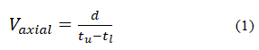

# Irregular Grid for Local Otsu Segmentation (IGLOS)

How to segment tracer particles from a sequence of two-dimensional non-uniform
baseline grey value images?

This project presents a novel image processing method that allows automatically
segment tracer particles based on two-dimensional sequence of images from the
[ROFEX (Ultrafast electron beam X-ray computed
tomography)](https://www.hzdr.de/db/Cms?pOid=30242&pNid=0) data.

[You can access the full article online: doi:10.1007/s00348-018-2523-2](https://link.springer.com/article/10.1007/s00348-018-2523-2/fulltext.html)

By Selam Waktola
selam.waktola@gmail.com

## Introduction

In most of industries, like in mining, agriculture, civil engineering, and
pharmaceutical manufacturing, silos are commonly used to store, protect and load
for bulk materials into process machinery. However, the way the material is
discharged through the outlet of the silo and the related dynamic effects of the
flow are important questions, which are still not completely understood because
they can have multiple causes. There are several interrelated parameters which
can affect the discharging process of granulates, such as the internal friction,
packing density, particle size distribution, hopper geometry, material type and
inherent properties. These have direct influences on unwanted phenomena such as
arching, which are the most common problems for funnel flow. Segregation is also
an undesirable phenomenon when a homogeneous mixture is required, for example,
in metallurgical and pharmaceutical industries (Ketterhagen et al., 2007).

Because granular materials are usually made of a very large number of individual
cohesion-less elements, the prediction of their individual behavior is also a
very challenging task that can be difficult to support with experimental data,
such as discrete element method (DEM) (Ketterhagen et al., 2007). Hence, this
project aims to provide trustful local non-invasive measurements of flow
dynamics, with a new image processing approach to study particle motion using
ultrafast X-ray tomography scanner.

Scanning measurements were taken at three different heights of the pipe still
well above the conical part close to the outlet. Seramis® is used as a granular
material and tracer particles were irregular shape added the X-ray attenuation
of which was enhanced by impregnating them with NaOH.

The first challenge consisted of a non-uniform baseline grey value which made it
impossible to use a general threshold for a binarization of the image sequences.
The algorithm solved the problem by a subdivision into smaller regions of
interest in which more or less constant background and contrast were found.
Their main goal was the definition of interrogation windows containing at the
best one single marker particle at a time. The method is based on a sequential
segmentation in x and y directions and a combination of both results to obtain a
rectangular grid of cell boundaries. 

The overall method named IGLOS(Irregular Grid Local Otsu Segmentation) is stated in detail in the published article (Waktola et al., 2018).

(Fig. 1 Principle of ultrafast electron beam X-ray CT scanner with cylindrical
silo model with 20 tracer particles picture.)

------


------

### Prerequisites

MATLAB R2013a

### Let’s start

#### MATLAB command line

```matlab

clear; % empty workspace

fileName = ‘filename.tif’; 

totalFrame = 2000;  % total number of frames

for i=1:totalFrame-1

vol(:,:,i) = imread(fileName,i);

end

```

#### Apply global threshold

```matlab

middleFrame = vol(:,:,1000) ; % take one frame of an image that contains some tracer particles


figure,subplot(121)

imshow(middleFrame)

title('original image')

subplot(122)

bw = im2bw(middleFrame,graythresh(middleFrame)) ; % apply global threshold using Otsu method

imshow(bw)

title('global Otsu threshold')

```

Output (Fig. 2 global Otsu threshold)

------


------

The result is not satisfactory, besides the noise and non-uniform baseline grey
value on the original raw images, each tracer particle characterizes a different
irregular size and slightly uneven infiltration of Sodium hydroxide, which gives
different X-ray absorption and images brightness level. As a result, the image
binarization method a very challenging task. Algorithms like Otsu tend to be
poor and even fail to segment tracer particles effectively as shown in the above
figure 2.

Hence, in order to obtain segmented images with a clear and solid particle
shape, a more sophisticated method is necessary than using general image
threshold methods. The proposed approach is inspired and slightly adapted from
Deoxyribonucleic acid (DNA) microarray image processing techniques, which is
commonly used to measure mass gene expressions (Hirata et al., 2001).

The entire proposed algorithm, named IGLOS (Irregular Grid for Local Otsu
Segmentation) consists of three major steps:

#### (A) Manual threshold (Image-A):

This step is for finding the projection area of each tracer particles and to
make sure that all tracer particles are identified. Maximum intensity projection
(MIP), average intensity projection (AIP) and minimum intensity projection
(MinIP) are volume-rendering techniques used to define the region of interest on
the two-dimensional CT image data set. In the case of MIP, it produced
high-contrast between tracer particles and the background. As a result, based on
the MIP technique, firstly, all raw image frames (for i=1, 2,…, N, where N is
the total number of frames to be analyzed) is rendered. Secondly, this rendered
image is segmented by simply applying manually set threshold value so as to
satisfyingly reveal all tracer particles. 
(Alternative option: instead of using one global grid, skip this step-A and start using each frame sequence of the original image as an input in the following step-B, in which it will create different local grids for each frame).

```matlab

volProj = max(vol,[],3); % maximum intensity projection - (shown in fig.3b)

projAdj = imadjust(volProj,[0.58 1]) ; % manual intensity adjustment

projBW1 = im2bw(projAdj,0.22); % manual threshold

projBW2 = bwareaopen(projBW1, 10); % remove small dots - (shown in fig.3c)

```

Output (Fig. 3): Illustration of step-A. (a) representation of time series of 2D
frames, (b) corresponding MIP and (c) its manual segmentation.

------


------

#### (B) Automatic global gridding (Image-B):

This step intends to create a non-regular grid for image-A (fig. 3c), with the
aim of having in each grid cell one segmented particle with an optimal
background space. To do so, the grid creation is divided into six sub-steps: We
are looking for a regular grid of spots so we start by looking at the mean
intensity for each column of the image. This will help to identify where the
centers of the spots are and where the gaps between the spots can be found.

1. Creating a mean horizontal profile: This step is used to determine the center
of each cell by plotting the mean intensity of each 256 columns of image-A
(image-A is 256 by 256-pixel size, see fig. 3c). As shown in fig. 4, the
original horizontal profile is irregular and it creates several peaks. If those
peaks are used to estimate the gap between each cell, it will generate tiny cell
space and a poor local segmentation result. Thus, there is need to enhance the
profile by applying an auto-correlation method, which is detailed in the next
step.

```matlab

hProfile = mean(projBW2); % horizontal profile, input image from step-A

figure('position',[40 350 400 150]);

plot(hProfile);

hold on;

[pks,locs] = findpeaks(hProfile); % find peaks

plot(locs,pks, 'r^'); % horizontal profile with peaks

hold off;

```

Output (Fig. 4): Mean horizontal profile of segmented image (fig. 3c) with
identified peaks in a red triangle (10 black triangles at the bottom, shows
positions where intensity value is zero).

------


------

2. Applying auto-correlation and estimate cell spacing: In order to find the
peaks and estimate a solid cell to cell gap, it is necessary to enhance the
self-similarity of the mean profile by using auto-correlation, which estimates
the auto-covariance sequence of the profile. A typical result applied on the
mean intensity profile which is shown in the above figure (fig. 4) is presented
in fig. 5, where the peaks are identified by red triangles based on the left and
right slopes of the auto-correlated profile. In that case, the estimation of the
cell spacing value can be found by calculating the mean difference of maxima.

```matlab

atcr = xcov(hProfile); % unbiased autocorrelation

figure('position',[-5 400 550 100]);

plot(atcr)

ls = diff(atcr([1 1:end])); % left slopes

rs = diff(atcr([1:end end])); % right slopes

pks = find(ls>0 & rs\<0); % peaks

nomSpace = round(median(diff(pks))) % nominal spacing

hold on

plot(pks,atcr(pks),'r^')

hold off

axis tight

%% nomSpace =

%% 21

```

Output (Fig. 5): Identified peaks in red triangle based on the left and right
slopes of the auto-correlated profile).

------


------

3. Applying top-hat filter: In order to enhance the mean profile, a
morphological top-hat filtering is applied to the profile with a linear
structuring element of length equal to the obtained estimated cell spacing value
(in the present case, the length is equal to 33 pixels). One can see in fig. 6
the effect of such filtering on the original mean profile shown in fig. 4. The
number of triangles, which depicts the edges of zero-intensity value regions,
but also intensity peaks, has increased.

```matlab

strLine = strel('line',nomSpace,0);

hProfile2 = imtophat(hProfile,strLine);

figure('position',[50 500 300 100]);

plot(hProfile2)

axis tight

```

Output (Fig. 6): Enhanced mean horizontal profile (red triangles shows positions
where intensity value is zero at the edges of each peak)).

------


------

4. Applying automatic threshold and locating the centroid between adjacent
labeled peaks: At this stage, a better separation of the peaks is obtained;
hence it is possible to segment and labels each peak region using Otsu's method.
Then, one can easily calculate its median position between each adjacent labeled
peak where the intensity value is zero, as illustrated by the red circle in fig.7.

```matlab

level = graythresh(hProfile2/255)*255;

bw = im2bw(xProfile2/255,level/255);

L = bwlabel(bw);

figure('position',[50 500 300 100]);

plot(L)

axis tight

hold on;

stats = regionprops(~L); % get zeros

centroids = [stats.Centroid];

xCenters = centroids(1:2:end);

plot(xCenters,1:max(~L),'ro')

hold off

%% xCenters =

%% Columns 1 through 8

%% 11.5000 45.0000 62.0000 76.5000 107.0000 117.0000 141.0000 160.5000

%% Columns 9 through 11

%% 186.0000 211.5000 245.0000

```

Output (Fig. 7): Enhanced mean horizontal profile with a centroid between
adjacent labelled peaks in red circle.).

------


------

5. Getting vertical lines of the grid between the adjacent labeled peaks: The
midpoint between the adjacent centers of each label peak provides locations of
the vertical lines of the final grid, as illustrated in fig. 8.

```matlab

xGrid = round([xCenters(1:end)])

figure('position',[50 500 300 100]);

plot(hProfile2)

for i=1:length(xGrid)

line(xGrid(i)*[1 1],ylim,'color','m')

end

%% xGrid =

%% 12 45 62 77 107 117 141 161 186 212 245

```

Output (Fig. 8): Enhanced mean horizontal profile with a centroid between
adjacent labeled peaks in red circle.).

------


------

6. Transposing image-A and repeating steps 1-5: This is the final step to
retrieve the horizontal grid lines. The final result of the non-regular grid is
shown in fig. 9. Note that particles can be cut by grid lines and portions of
more than one particle can occur in the same grid cell.

```matlab

vProfile = mean(projBW2'); % vertical profile

atcr = xcov(vProfile); % unbiased autocorrelation

ls = diff(ac([1 1:end])); % left slopes

rs = diff(ac([1:end end])); % right slopes

pks = find(ls>0 & rs<0); % peak locations

nomSpace = round(median(diff(pks))) % nominal spacing

strLine = strel('line',nomSpace,0);

vProfile2 = imtophat(vProfile,strLine); % background removed

level = graythresh(vProfile2/255); % automatic threshold level

bw = im2bw(vProfile2/255,level); % binarized peak regions

L = bwlabel(bw); % labeled regions

stats = regionprops(~L); % get zeros

centroids = [stats.Centroid]; % centroids

yCenters = centroids(1:2:end) % Y-parts only

yGrid = round([yCenters(1:end)])

%% nomSpace =

%% 33

%% yCenters =

%% Columns 1 through 7

%% 11.5000 48.0000 77.5000 114.0000 152.5000 187.0000 204.5000

%% Columns 8 through 9

%% 224.0000 249.0000

%% yGrid =

%% 12 48 78 114 153 187 205 224 249

```

Put interrogation windows (IW) containing at the best one single marker particle at a time.

```matlab

figure,imshow(projBW2)

line(xGrid'*[1 1],yGrid([1 end]),'color','m')

line(xGrid([1 end]),yGrid'*[1 1],'color','m')

[X,Y] = meshgrid(xGrid(1:end-1),yGrid(1:end-1));

[dX,dY] = meshgrid(diff(xGrid),diff(yGrid));

IW = [X(:) Y(:) dX(:) dY(:)]; % interrogation windows (IW)

```

Output (Fig. 9): Final grid lines superimposed on the segmented MIP image shown on figure 3c).

------


------

#### (C) Segmentation using local threshold:

First, the non-regular grid is used to set a 3D grid of size RxCx1 cells, where R is the number of horizontal partition, C the number of vertical partition and one partition concerns the full height of tomographic frame compilation.

Finally, for individual segmentation of tracer particles, it is possible to use each grid cell to increase the contrast of the original raw image and determine its own local threshold level automatically using the Otsu method. In another word, the automatic local threshold level and the contrast value is set depending on the brightness of each tracer particles with the corresponding 3D
grid cell. A final result is shown in fig. 10b for a
given cross-section. This naturally shows less segmented particles than in the
case of the MIP (maximum intensity projection), since all tracer particles are
not exactly located in the same plane. The overall segmentation algorithm is summarized in the flowchart shown in fig.11.

```matlab

middleFrame = vol(:,:,1000) ; % take one frame an image that contains some tracer particles

figure, subplot(121) , imshow(middleFrame)

line(xGrid'*[1 1],yGrid([1 end]),'color','m')

line(xGrid([1 end]),yGrid'*[1 1],'color','m')

bw = false(size(middleFrame));

for i=1:length(IW)

rows = round(IW(i,2))+[0:(round(IW(i,4))-1)];

cols = round(IW(i,1))+[0:(round(IW(i,3))-1)];

spot = middleFrame(rows,cols);

bw(rows,cols) = im2bw(spot,graythresh(spot));

end

subplot(122) , imshow(bw)

```

Output (Fig. 10): (a) Global grid masked with original image at scanning height of 800 mm discharging time of 11.6 s. (b) After local Otsu segmentation applied on an irregular grid (IGLOS)).

------


------

Output (Fig. 11): Full flowchart of the segmentation algorithm.

------


------

#### Calculating axial particle velocity 

The ROFEX scanner comes with two measurement planes, which gives an ability to determine the axial velocity of particles. The axial velocity of tracer particle was calculated based on the residence time of a particle in a CT plane, which is the statistical analysis of successive frames or discharging time of tracer particles while passing both measurement planes. The distance d between the two measurement planes is 11 mm, as already mentioned earlier. Hence, the axial velocity Vaxial can show the tracer particle movement rate in the axial direction, which is calculated as: 


             
Where t_u  and tl  are the time detection of the same tracer particle in the upper and lower measurement planes respectively. In general, the velocity calculations considered when the particles enter the scanning planes.
Based on the above equation (1), the axial mean velocity is equal to 9.373 mm/s. Besides the potential of accurately measure velocities, this knowledge is also an important parameter in order to reconstruct particle volume, as it is mentioned in the following section.


#### Three-dimensional view of segmented tracer particles

To visualize and represent the real size of tracer particles in 3D, first, it needs to convert the time frames of segmented images into voxel size along the z-dimension (note that the z-dimension represents time in milliseconds). Since the mean axial velocity Vaxial of each tracer particle has been evaluated and the acquisition rate f (2,000 cross-sectional images per second) and the spatial resolution SR of the X-ray system are known parameters(about 1 mm), it is possible to estimate the average number of frames of an image Nv that corresponds to the same pixel size of the reconstructed cross-section as follows:


The segmented frames of tracer particles can now be separated into stacks of Nv frames at most that are averaged to allow the space conversion. 

So far, only one frame of an image that contains some tracer particles are taken in the above procedures.

(%% middleFrame = vol(:,:,1000); % take one frame of an image that contains some tracer particles)

However, the sequence of X-ray image contains 2000 frames of image, hence to segment the tracer particles for the entire sequence of the image, there need to repeat applying the same procedure inside a loop.
(Alternative option: instead of using one global grid, skip this step-A and start using each frame sequence of the original image as an input in step-B, in which it will create different local grids for each frame).

Afterwards, the following procedures will allow seeing the isosurface of the rebuilt 3D tracer particles.


```matlab

totalFrame = 2000; % number of frames of an image to be segmented/analyzed.

fileName = ‘filename.tif’; 

totalFrame = 2000;  % total number of frames

sb = 20; % sub block of images deraved from equation 2: Nv

dim = size(vol);

%%dim =

%%         256         256        2000
         
nbblocks = ceil(dim(3)./sb); %z-dimension represents time in milliseconds

for i=1:totalFrame-1

  selectedFrame = vol(:,:,i);   
 
  %%# Follow and apply step (C) above: Segmentation using local threshold.

  %BW = segmentedFrame;  % final segmented output frame

end

%% BW = output of above loop-sequence of segmented trace particles.

isosurface(BW,0.9);axis([0 256 0 256 0 70]);

grid on;

myslice = BW;

rfactor = 0.125;  % patch smoothing factor

level = .8;   % isosurface size adjustment

%useful string constants

c2 = 'facecolor';

c1 = 'edgecolor';

% build one isosurface for each of 7 different levels

% the "myslice" matrix takes on one of 7 integer values,

% so each of the following converts the data to a binary

% volume variable, then computes the isosurface between the 1 and 0 regions

p=patch(isosurface(smooth3(myslice==1),level));

reducepatch(p,rfactor)

set(p,c2,[1,0,0],c1,'none');

p=patch(isosurface(smooth3(myslice==2),level));

reducepatch(p,rfactor)

set(p,c2,[0,1,0],c1,'none');

p=patch(isosurface(smooth3(myslice==3),level));

reducepatch(p,rfactor)

set(p,c2,[1,1,0],c1,'none');

p=patch(isosurface(smooth3(myslice==4),level));

reducepatch(p,rfactor)

set(p,c2,[0,0,1],c1,'none');

p=patch(isosurface(smooth3(myslice==5),level));

reducepatch(p,rfactor)

set(p,c2,[1,0,1],c1,'none');

p=patch(isosurface(smooth3(myslice==6),level));

reducepatch(p,rfactor)

set(p,c2,[0,1,1],c1,'none');

p=patch(isosurface(smooth3(myslice==7),level));

reducepatch(p,rfactor)

set(p,c2,0.8*[1,1,1],c1,'none');

% lighting/image control

set(gca,'projection','perspective')

% box on

lighting phong

light('position',[1,1,1])

light('position',[-1,-1,-1])

light('position',[-1, 1,-1])

light('position',[ 1,-1,-1])

% set relative proportions

daspect([1,1,1])

axis on

set(gca,'color',[1,1,1]*.6)

view(-30,30)

rotate3d on

```

Output (Fig. 12): 3D view of segmented 15 tracer particles, for a better
visualization of identified tracer particles, the silo tube is also included in
the below three-dimensional image views).

------


------

## Reference

Waktola, S., Bieberle, A., Barthel, F., Bieberle, M., Hampel, U., Grudzień, K., Babout, L.: A new data-processing approach to study particle motion using ultrafast X-ray tomography scanner: case study of gravitational mass flow. Exp. Fluids. 59, 69 (2018). doi:10.1007/s00348-018-2523-2

Ketterhagen, W. R., Ende, M. T. and Hancock, B. C. (2009) ‘Process Modeling in
the Pharmaceutical Industry using the Discrete Element Method’, *Journal of
Pharmaceutical Sciences* , 98(2), pp. 442-470.

Hirata, J., Barrera, J., Hashimoto, R. F. and Dantas, D. O. (2001) ‘Microarray
gridding by mathematical morphology’, in Proceedings XIV Brazilian Symposium on
Computer Graphics and Image Processing. IEEE Comput. Soc, pp. 112–119.

## Author

***Selam Waktola** - *selam.waktola@gmail.com* -
[selamgit](https://github.com/selamgit)

## License

This project is licensed under the MIT License - see the
[LICENSE.md](LICENSE.md) file for details
